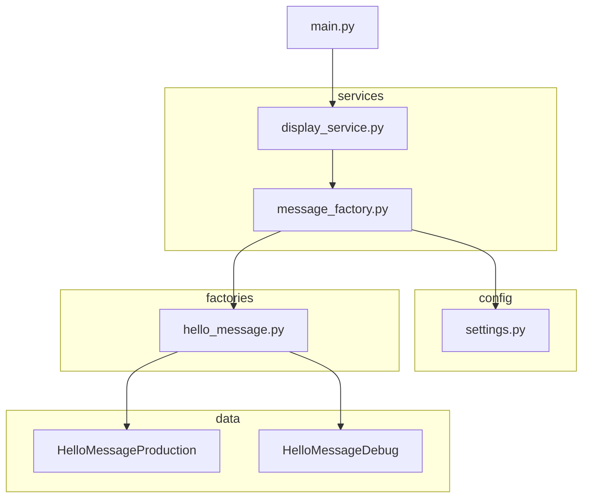

# Hello World Over-Engineered

> Because sometimes, "print('Hello, World!')" just isn't enough.

## Table of Contents

- [Hello World Over-Engineered](#hello-world-over-engineered)
  - [Table of Contents](#table-of-contents)
  - [Historical Background](#historical-background)
  - [Project Structure](#project-structure)
  - [Contributors](#contributors)
  - [Legacy](#legacy)
  - [Usage](#usage)

## Historical Background

In the early days of computing, programmers were content with simple programs like the classic "Hello, World!". As time went on and systems grew in complexity, so did the need for more robust software development practices.

However, in 2023, a group of developers (with a hint of irony and lots of free time) decided to push the boundaries of what's reasonable, and thus, "Hello World Over-Engineered" was born.

This project stands as a monument to the dangers of overthinking and over-engineering. It's a reminder that sometimes the simplest solution is the best.

## Project Structure

The project's architecture is an embodiment of excessive abstraction layers, reminiscent of enterprise software for billion-dollar corporations, just to print a greeting.

- `config`: Where we define the mode of our application (because you need to know if your "Hello, World!" is production-ready).
- `services`: Handles the logic to display messages.
- `factories`: In charge of creating the right kind of message, because one doesn't just "create" a message!
- `data`: Where our precious messages live.
## Contributors

A huge thank you to the overthinkers and abstraction lovers:

- Don "Overkill" Johnson
- Don "Why Not Add Another Layer" Johnson
- Don "Abstract All The Things" Johnson

And many others who contributed to this ironically heavy project.

## Legacy

While this repository began as a joke, it has now been used in numerous software engineering courses worldwide as an example of how *not* to structure a project. It also became a meme in many developer communities, reminding developers of the perils of over-engineering.

## Usage

To run this masterpiece:

1. Ensure you have Python installed.
2. Clone the repository.
3. Navigate to the `HelloWorldApp` directory.
4. Run `main.py`.

**Diagram**

**Disclaimer:** Running this might make you rethink your software design choices.
